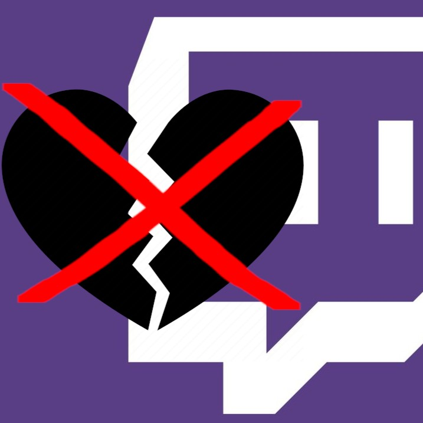

# **No Unfollow Button for Twitch**

This is a Firefox extension that removes the "Unfollow" button from Twitch. It's a simple extension that does one thing, and it does it well.

## Installation
Install it in the firefox addons store: https://addons.mozilla.org/en/firefox/addon/no-unfollow-twitch/

## Usage
Once installed, the extension will automatically remove the "Unfollow" button from Twitch. You can still unfollow channels by going to the channel page and clicking the "Unfollow" button there.

## Contributing
If you want to contribute to this project, feel free to fork it and submit a pull request.

## How to install
1. Clone the repository
2. Open Firefox and go to `about:debugging`
3. Click `This Firefox`
4. Click `Load Temporary Add-on...`
5. Select any file in the extension's directory

## Screenshots

## License
This project is licensed under the MIT License - see the [LICENSE](LICENSE) file for details
